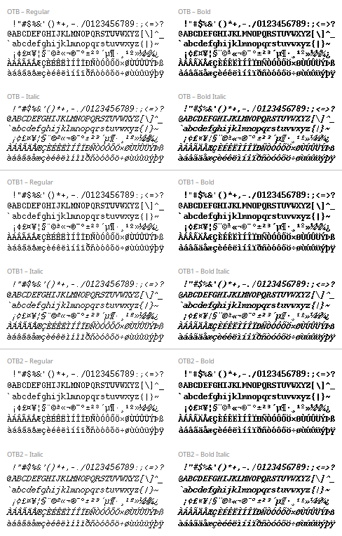

# Adobe Courier (OTB)

OpenType Bitmap (`.otb`) packaging of the classic **Adobe Courier** X11 bitmap font, plus two variants with adjusted line spacing
for use in modern GTK / Pango applications.

All three variants (OTB, OTB1, OTB2) at 9 pt — Regular, Bold, Italic, and Bold Italic:



## Background

The **Adobe Courier** bitmap font family carries copyright notices by Adobe Systems Incorporated (1984-1989, 1994) and Digital
Equipment Corporation (1988, 1994). It has shipped with the X Window System for a very long time as part of the
`xorg-fonts-100dpi` and `xorg-fonts-75dpi` packages and is available on most Linux systems as
`/usr/share/fonts/X11/100dpi/courR*.pcf.gz` (and similar). The fonts were originally distributed in BDF / PCF form, accompanied by
a permissive (MIT/X11-style) license notice that allows redistribution and modification (see `LICENSE`). Modern Pango (and
therefore GTK 3 / 4) no longer renders classic PCF / BDF bitmap fonts reliably. The OpenType Bitmap (OTB) container, however, is
recognized by FreeType / Fontconfig / Pango and lets these bitmap fonts work in current GTK applications.

This repository contains the Adobe Courier bitmaps repackaged as `.otb` files in three variants.

### Original sources

- X.Org master repository (BDF originals): https://gitlab.freedesktop.org/xorg/font/adobe-100dpi
  and https://gitlab.freedesktop.org/xorg/font/adobe-75dpi
- Debian / Ubuntu packages: `xfonts-100dpi`, `xfonts-75dpi`
- Arch Linux package: `xorg-fonts-100dpi`, `xorg-fonts-75dpi`
- Fedora / RHEL: `xorg-x11-fonts-100dpi`, `xorg-x11-fonts-75dpi`

## Variants

Three font families are provided. They contain identical glyph bitmaps but differ in their built-in line spacing. Choose the one
that best matches your application:

| Family                 | Built-in line spacing | Use when                                                                                                                                    |
| ---------------------- | --------------------- | ------------------------------------------------------------------------------------------------------------------------------------------- |
| `Adobe Courier (OTB)`  | original (tight)      | You want the original X11 look, or your toolkit lets you adjust line spacing yourself (e.g. KDE / Qt).                                      |
| `Adobe Courier (OTB1)` | +1 px above           | GTK applications: a little extra room for accents on capitals.                                                                              |
| `Adobe Courier (OTB2)` | +1 px above, +1 below | GTK applications: comfortable spacing for both top accents and bottom diacritics; gives spell-checkers enough room for squiggly underlines. |

The three families have distinct family names, so they can be installed in parallel and selected independently.

Available pixel sizes (each in Regular, Bold, Oblique, Bold Oblique): 8, 10, 11, 12, 14, 17, 18, 20, 24, 25, 34.

## Installation

### For the current user

Install all three variants:

```sh
./install-all-user.sh
```

Or install individually:

```sh
adobe-courier-otb/install-user.sh
adobe-courier-otb1/install-user.sh
adobe-courier-otb2/install-user.sh
```

Files are placed under `~/.local/share/fonts/adobe-courier-otb{,1,2}/` and the font cache is refreshed automatically.

### System-wide

```sh
sudo ./install-all-system.sh
```

Files are placed under `/usr/local/share/fonts/adobe-courier-otb{,1,2}/`.

### Uninstall

For a single variant:

```sh
rm -rf ~/.local/share/fonts/adobe-courier-otb1 && fc-cache -f
```

(adjust path/variant as needed; use `sudo` for system installs).

## Selecting the font in applications

Use the family name exactly as listed above:

- `Adobe Courier (OTB)`
- `Adobe Courier (OTB1)`
- `Adobe Courier (OTB2)`

Pango / GTK font strings: `Adobe Courier (OTB1) 14px`. The `px` suffix ensures Pango asks for the bitmap strike at that pixel
size.

## Regenerating the variants

Variants OTB1 and OTB2 are derived from OTB by small Python scripts that adjust font metrics (using `fontTools`):

```sh
python3 adobe-courier-otb1/make-otb1.py
python3 adobe-courier-otb2/make-otb2.py
```

Requires Python 3 with the `fontTools` package (`pip install fonttools` or your distro's `python3-fonttools`).

## License and redistribution

The Adobe Courier bitmap font data is covered by a permissive (MIT/X11-style) license; see `LICENSE` for the full text.

The Python scripts and shell scripts in this repository are placed in the public domain (0BSD); see `LICENSE`.
